Clasificación de imágenes satelitales con R
================

*Funciones de la cápsula de clasificación satelital*

## Introducción

El siguiente documento tiene por objetivo relatar el paso a paso para
realizar una clasificación de imágenes de satélite. Esta clasificación
es de tipo **Supervisada** utilizando un algoritmo de **Machine
learning**, en específico, **Redes Neuronales Artificiales** (o *ANN*
por sus siglas en inglés). Para ello, el procedimiento incluye la
utilización de los software QGIS y R.

Claro que lo primero que se debe realizar es obtener los insumos base
(imágenes satelitales). La obtención es realizada utilizando el [API de
Python de Google Earth Engine](Otros/SIGTEL_DescargaS2.ipynb), por lo
tanto, revisar el Script para la descarga de imágenes.

## Preparación de escenas de NDVI

El primer paso para realizar la clasificación, es adecuar los insumos a
utilizar. De las imágenes satelitales, se obtiene una serie
multi-temporal de *NDVI*, la cual será utilizada para poder obtener un
insumo de menor longitud (menos capas) y simplificado para ser
incorporado al modelo de clasificación.

En resumen, lo que se realiza es obtener un valor de *NDVI* por mes,
para ello se requiere poder transformar la serie de tiempo irregular (a
menos que no exista ninguna nube durante el año, podría ser regular)
mediante una función de suavizado y de esta forma obtener datos
mensuales.

Como siempre, lo primero es cargar librerías, establecer el directorio
de trabajo y listar los archivos .tif de *NDVI*. Junto a ello, se
convertirán los nombres de los archivos a formato de fecha, se ordenarán
los archivos por fecha, se cargarán los archivos en un raster multicapa
y se establecerá la dimensión Z de a partir de las fechas.

``` r
library(raster)
library(ClusterR)

setwd("~/Desktop/Clasificación_satelital/S2_clasificacion/NDVI/")

files <- list.files(pattern = 'ndvi.*.tif$', full.names = T,recursive = F)

dates <- as.Date(gsub(pattern = '.*ndvi_',replacement = '',x = files), format = '%Y%m%d.tif') # '%Y_%j.tif'

files <- files[order(dates)]

dates <- dates[order(dates)]

files_stack <- stack(files)

files_stack <- setZ(files_stack, dates)
```

Para revisar que se cargaron bien los archivos ráster, se puede imprimir
alguna de las fechas para probar que hayan sido bien cargadas:

``` r
plot(files_stack[[1]], zlim  =c(0,1))
```

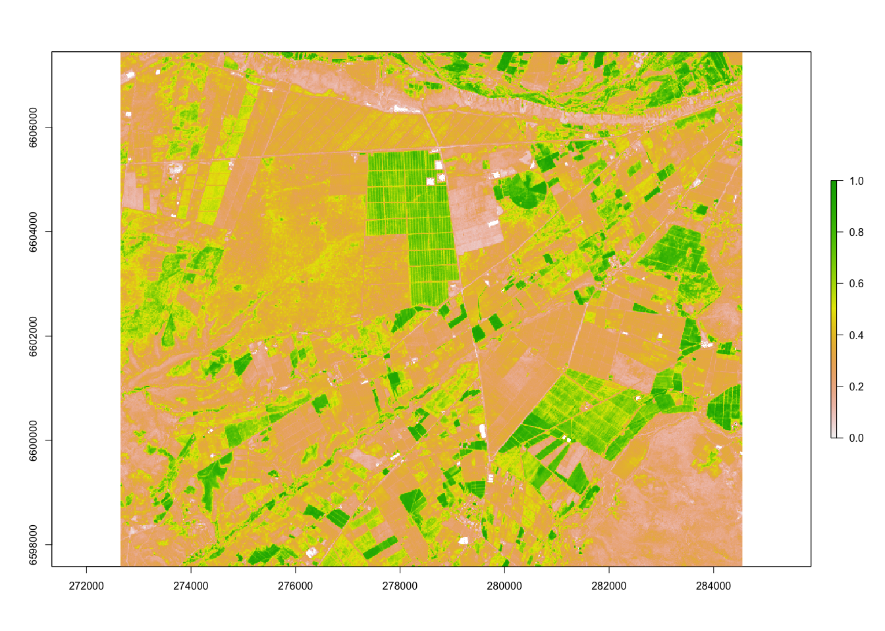<!-- -->

Luego, para ir probando el suavizado de *NDVI*, se carga una shapefile
de puntos con datos de algunos cultivos para el testear las funciones
base de `R` para el suavizado de curvas:

``` r
shp <- shapefile('~/Desktop/Clasificación_satelital/Prueba.shp')

plot(files_stack[[20]], zlim  =c(0,1))
plot(shp, add = T, pch=20,cex=2)
```

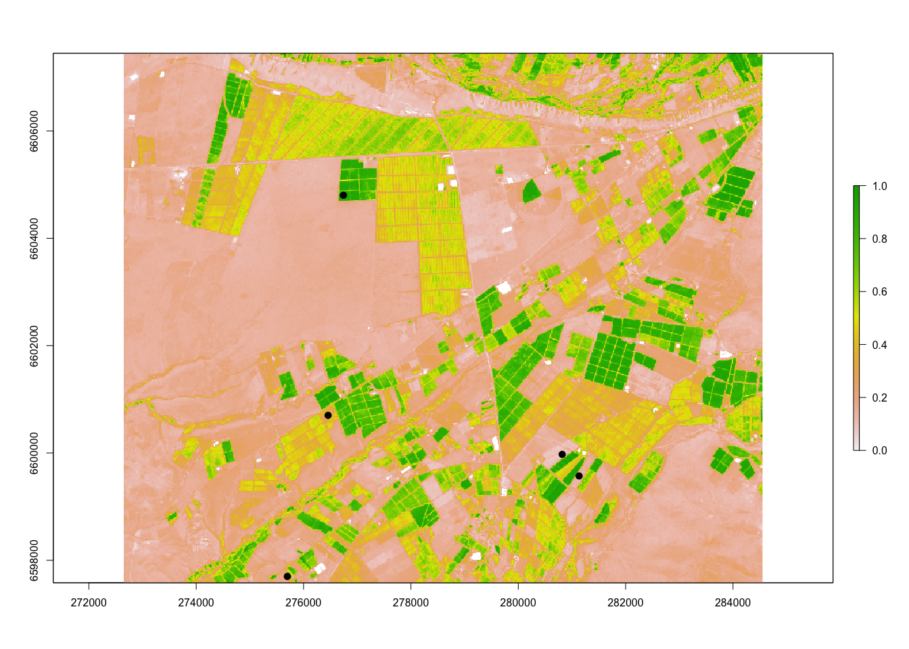<!-- -->

Se procede a extraer los datos de *NDVI* de las fechas cargadas,
ordenando los resultados:

``` r
test <- raster::extract(files_stack,shp,df=T)

df <- as.data.frame(t(as.matrix(test[-1])))
df <- cbind(df, dates)
names(df) <- c('c1','c2','c3','c4','c5','dates')
```

Para el suavizado de *NDVI*, se pueden utilizar dos tipos de funciones
(dentro del universo existente). Estas son `smooth.spline` y `loess`.
Ambas se presentan a continuación probadas en diferentes coberturas
agrícolas:

``` r
# Vid de mesa
plot(x=df$dates,y = df$c1,col='red',xlab=NA,ylab='NDVI',ylim=c(0,1),main='Vid de mesa')
lines(x=df$dates,y=predict(smooth.spline(x=df$dates,y = df$c1, spar = 0.5))$y, col='blue')
lines(x=df$dates,y=predict(loess(c1~as.numeric(dates),df, span = 0.2)),col='green')
```

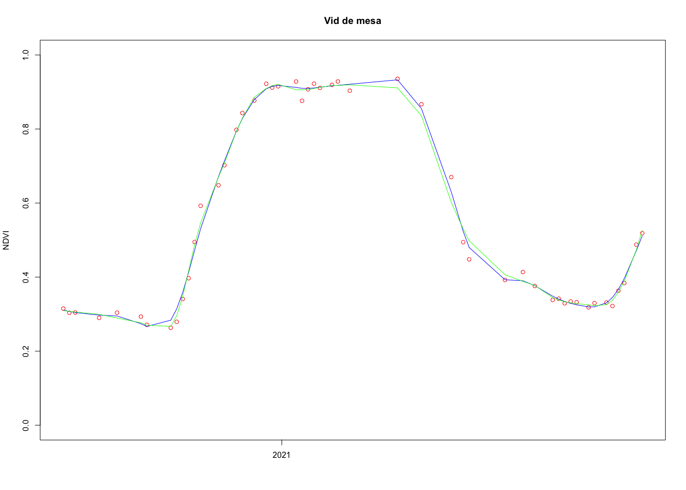<!-- -->

``` r
# Cultivo de ciclo corto
plot(x=df$dates,y = df$c2,col='red',xlab=NA,ylab='NDVI',ylim=c(0,1),main='Cultivo de ciclo corto')
lines(x=df$dates,y=predict(smooth.spline(x=df$dates,y = df$c2, spar = 0.5))$y, col='blue')
lines(x=df$dates,y=predict(loess(c2~as.numeric(dates),df, span = 0.2)),col='green')
```

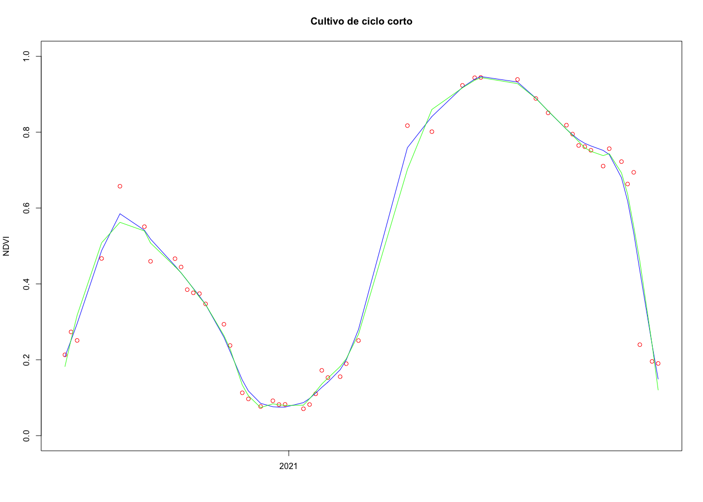<!-- -->

``` r
# Sin cultivo con malezas
plot(x=df$dates,y = df$c3,col='red',xlab=NA,ylab='NDVI',ylim=c(0,1),main='Sin cultivo con malezas')
lines(x=df$dates,y=predict(smooth.spline(x=df$dates,y = df$c3, spar = 0.5))$y, col='blue')
lines(x=df$dates,y=predict(loess(c3~as.numeric(dates),df, span = 0.2)),col='green')
```

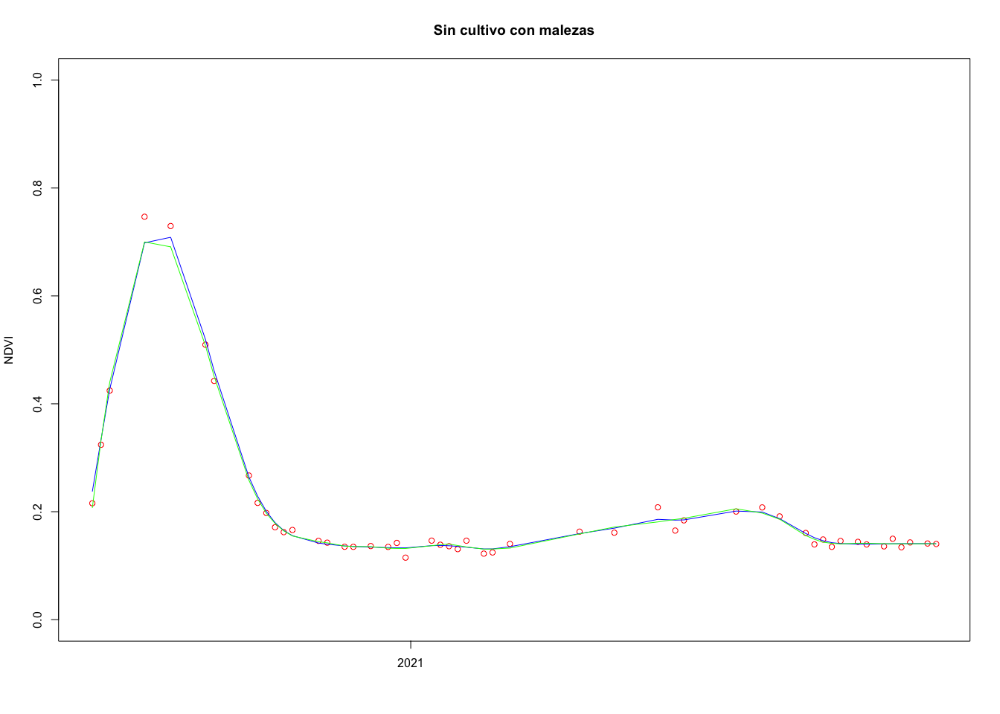<!-- -->

``` r
# Pradera 1
plot(x=df$dates,y = df$c4,col='red',xlab=NA,ylab='NDVI',ylim=c(0,1),main='Pradera 1')
lines(x=df$dates,y=predict(smooth.spline(x=df$dates,y = df$c4, spar = 0.5))$y, col='blue')
lines(x=df$dates,y=predict(loess(c4~as.numeric(dates),df, span = 0.2)),col='green')
```

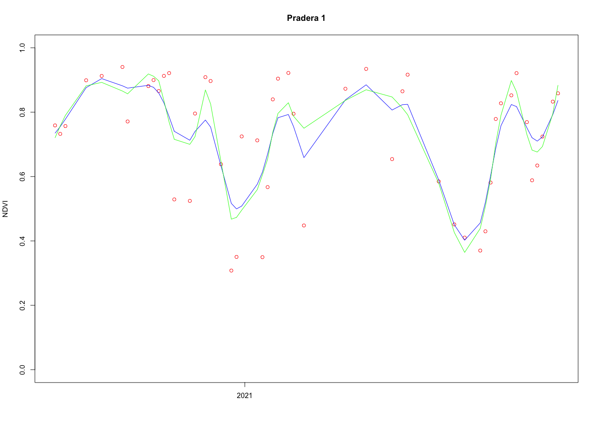<!-- -->

``` r
# Pradera 2
plot(x=df$dates,y = df$c5,col='red',xlab=NA,ylab='NDVI',ylim=c(0,1),main='Pradera 2')
lines(x=df$dates,y=predict(smooth.spline(x=df$dates,y = df$c5, spar = 0.5))$y, col='blue')
lines(x=df$dates,y=predict(loess(c5~as.numeric(dates),df, span = 0.2)),col='green')
```

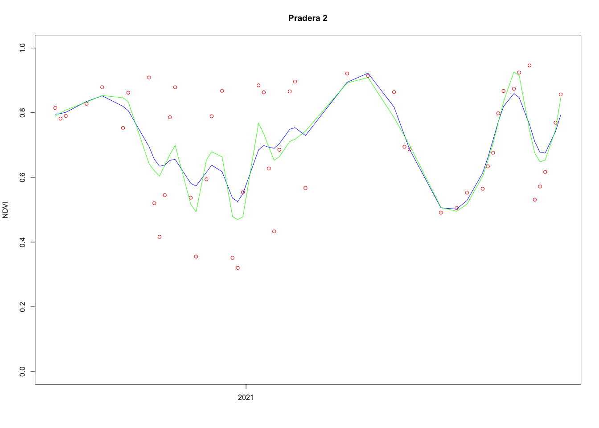<!-- -->

Como se puede apreciar, ambas funciones son muy similares, aunque
mientras más sea la variabilidad o dinámica de *NDVI*, las diferencias
serán mayores:

``` r
# Diferencia entre los datos, en formato línea
plot(x=df$dates,y = df$c5,type='l',col='red',xlab=NA,ylab='NDVI',ylim=c(0,1),main='Pradera 2')
lines(x=df$dates,y=predict(smooth.spline(x=df$dates,y = df$c5, spar = 0.5))$y, col='blue')
lines(x=df$dates,y=predict(loess(c5~as.numeric(dates),df, span = 0.2)),col='green')
```

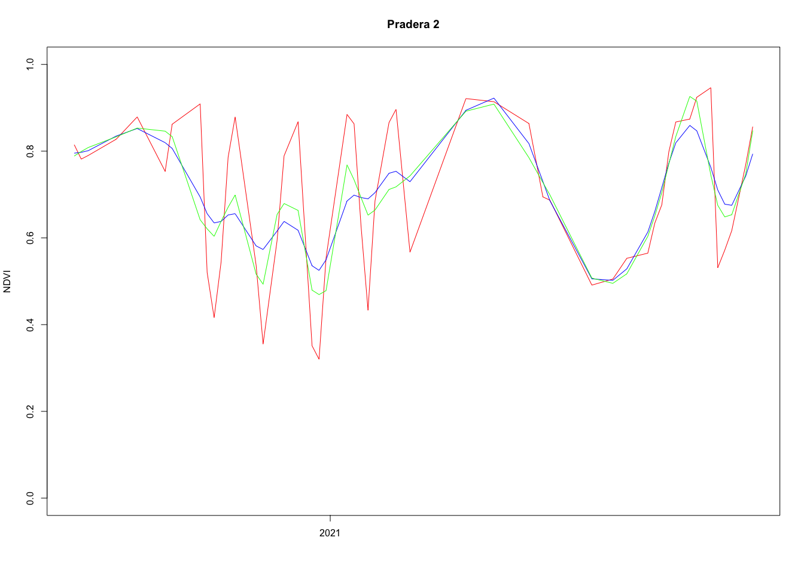<!-- -->

Más que nada, la diferencia se da entre los residuales de cada
regresión, siendo `smooth.spline` más sensible antre coberturas
dinámicas como las praderas:

``` r
# Vid de mesa
smooth.spline(x=df$dates,y = df$c1, spar = 0.5)$pen.crit
```

    ## [1] 0.01570326

``` r
loess(c1~as.numeric(dates),df, span = 0.2)$s
```

    ## [1] 0.02413044

``` r
smooth.spline(x=df$dates,y = df$c1, spar = 0.5)$pen.crit/loess(c1~as.numeric(dates),df, span = 0.2)$s
```

    ## [1] 0.6507656

``` r
# Cultivo de ciclo corto
smooth.spline(x=df$dates,y = df$c2, spar = 0.5)$pen.crit
```

    ## [1] 0.09896671

``` r
loess(c2~as.numeric(dates),df, span = 0.2)$s
```

    ## [1] 0.06213315

``` r
smooth.spline(x=df$dates,y = df$c2, spar = 0.5)$pen.crit/loess(c2~as.numeric(dates),df, span = 0.2)$s
```

    ## [1] 1.592817

``` r
# Sin cultivo con malezas
smooth.spline(x=df$dates,y = df$c3, spar = 0.5)$pen.crit
```

    ## [1] 0.006464644

``` r
loess(c3~as.numeric(dates),df, span = 0.2)$s
```

    ## [1] 0.01512985

``` r
smooth.spline(x=df$dates,y = df$c3, spar = 0.5)$pen.crit/loess(c3~as.numeric(dates),df, span = 0.2)$s
```

    ## [1] 0.4272774

``` r
# Pradera 1
smooth.spline(x=df$dates,y = df$c4, spar = 0.5)$pen.crit
```

    ## [1] 0.5675652

``` r
loess(c4~as.numeric(dates),df, span = 0.2)$s
```

    ## [1] 0.1315072

``` r
smooth.spline(x=df$dates,y = df$c4, spar = 0.5)$pen.crit/loess(c4~as.numeric(dates),df, span = 0.2)$s
```

    ## [1] 4.315848

``` r
# Pradera 2
smooth.spline(x=df$dates,y = df$c5, spar = 0.5)$pen.crit
```

    ## [1] 0.7104926

``` r
loess(c5~as.numeric(dates),df, span = 0.2)$s
```

    ## [1] 0.1338789

``` r
smooth.spline(x=df$dates,y = df$c5, spar = 0.5)$pen.crit/loess(c5~as.numeric(dates),df, span = 0.2)$s
```

    ## [1] 5.30698

Por lo mencionado, `smooth.spline` será la función utilizada para este
fin. Se genera una función personalizada que permita convertir la serie
multitemporal en ráster de pocas bandas. Esta función realiza lo
siguiente:

-   Elimina los `NA` de la serie de datos y ajusta las fechas en función
    de ello.
-   Si la serie contiene muy pocos datos, el resultado es una repetición
    del valor `0`.
-   Si la serie tiene una longitud adecuada, se genera un modelo e
    regresión de tipo spline
-   Se hace una predicción de los datos cada dos días
-   Se calcula un promedio mensual
-   Se ajustan a `0` los valores negativos
-   Se añade el valor de los residuales como banda número 13

``` r
## For settings
as.numeric(as.Date('2020-07-01')) #18444
```

    ## [1] 18444

``` r
as.numeric(as.Date('2021-07-01')) #18809
```

    ## [1] 18809

``` r
raster_spline_monthly <- function(x) {
  
  x[x==0] <- NA
  
  times <- times[!is.na(x)]
  
  x <- x[!is.na(x)]
  
  if (length(x) <= 4) {
    vals <- rep(0, length.out = 13) # months plus score
  }else{
    sp <- smooth.spline(x = times, y = x,spar = 0.5)
    vals <- predict(sp, seq(from = 18444,to = 18809,by = 2))
    vals <- aggregate(vals$y, list(format(as.Date(seq(from = 18444,to = 18809,by = 2), origin="1970-01-01"), "%Y-%m")), mean)[,'x']
    vals[which(vals <= 0)] <- 0
    vals <- round(c(vals*10,sp$pen.crit*10))
  }
  vals
}
```

El objeto `times` contiene las fechas en formato numérico, necesarias
para evaluar la función. Se procede a probar la función para visualizar
los resultados de las coberturas utilizadas anteriormente. Los valores
de *NDVI* (de -1 a 1), se ajustan a 0 a 10 y aquellos que son negativos,
se llevan a 0.

``` r
# test
times <- as.numeric(getZ(files_stack))
raster_spline_monthly(x = df$c1)
```

    ##  [1] 3 3 3 4 7 9 9 9 9 9 7 4 0

``` r
raster_spline_monthly(x = df$c2)
```

    ##  [1] 3 6 5 4 2 1 1 2 5 8 9 9 1

``` r
raster_spline_monthly(x = df$c3)
```

    ##  [1] 5 7 4 2 1 1 1 1 1 2 2 2 0

``` r
raster_spline_monthly(x = df$c4)
```

    ##  [1] 8 9 9 8 7 6 6 7 7 9 8 8 6

``` r
raster_spline_monthly(x = df$c5)
```

    ##  [1] 8 8 8 6 6 6 7 7 8 9 9 6 7

``` r
plot(x=1:12,y = raster_spline_monthly(x = df$c1)[1:12],col='red',xlab=NA,ylab='NDVI*10',ylim=c(0,10),type='l')
lines(x=1:12,y=raster_spline_monthly(x = df$c2)[1:12],col='green')
lines(x=1:12,y=raster_spline_monthly(x = df$c3)[1:12],col='blue')
lines(x=1:12,y=raster_spline_monthly(x = df$c4)[1:12],col='gray50')
lines(x=1:12,y=raster_spline_monthly(x = df$c5)[1:12],col='black')
```

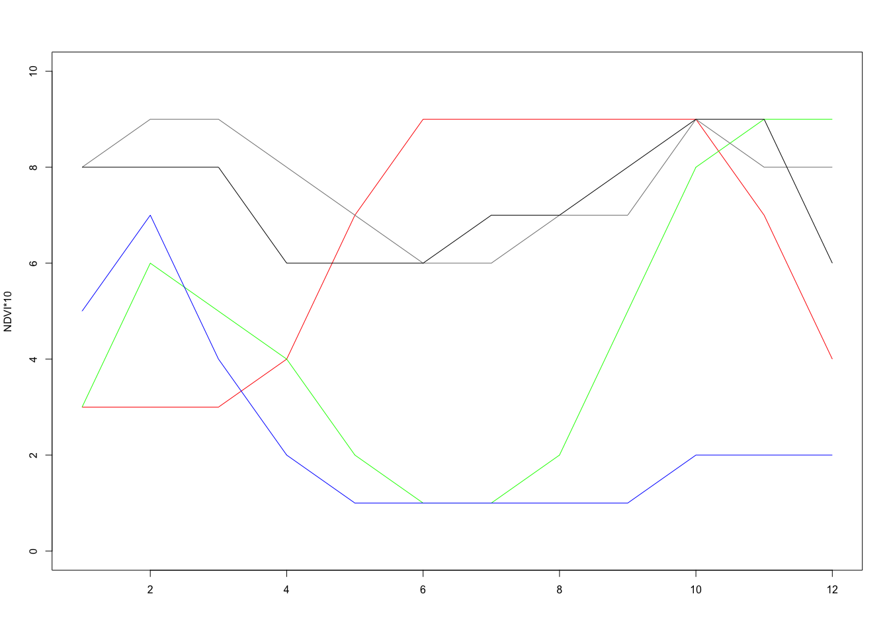<!-- -->

Al juzgar por los gráficos anteriores, el resultado es apropiado. Por
ende, se aplica la función sobre el ráster con un procedimiento en
paralelo, guardando los resultados:

``` r
beginCluster()

times <- as.numeric(getZ(files_stack))
result_ <- clusterR(files_stack, calc, args = list(fun = raster_spline_monthly), export = 'times')

endCluster()

rasterOptions(maxmemory = 6e+18, chunksize = 6e+18)

writeRaster(x = result_, filename = '~/Desktop/Clasificación_satelital/S2_clasificacion/NDVI/monthly_spline.tif', bylayer = F, datatype = 'INT2U',overwrite = T)
```

## Áreas de entrenamiento

Este procedimiento se realiza en QGIS. Está incorporado dentro de la
cápsula subida a Google Drive, por ende la explicación quedará ahí.

Las áreas de entrenamiento son las siguientes:

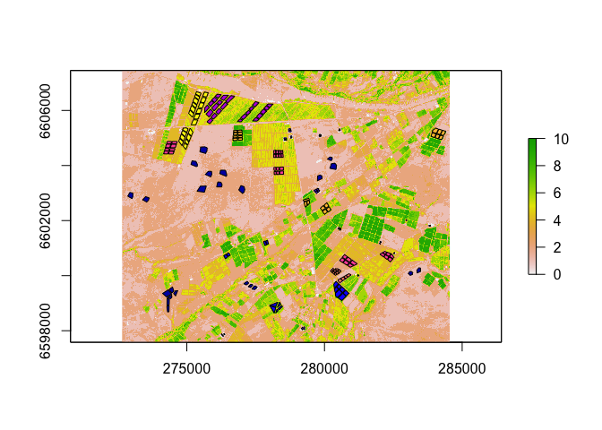<!-- -->

## Clasificación

Como siempre, se cargan las librerías necesarias y los archivos que se
utilizarán para este fin

``` r
library(raster)
library(sf)
library(exactextractr)
library(tidyverse)
library(caret)
library(doParallel)
library(snow)

setwd('~/Desktop/Clasificación_satelital/S2_clasificacion/NDVI/')

r <- stack('monthly_spline.tif')
sf <- read_sf('AreasEntrenamiento.shp')
```

Para hacer reproducible el ejemplo, se utiliza la función `set.seed()`
para seleccionar una semilla que permita seguir una secuencia de
generación de números aleatorios pre-definida.

Se consulta la clase menos frecuente (en términos de polígonos), y se
establece un tamaño de 85% para obtener los datos de entrenamiento del
modelo de Machine learning. Los polígonos restantes son almacenados en
un objeto que luego será utilizado para evaluar la clasificación.

``` r
set.seed(123)

pol_min <- min(round(table(sf$Class)*0.85))

id_train <- sf %>% st_drop_geometry() %>% group_by(Class) %>% select(Class,ID) %>% sample_n(pol_min)

sf_train <- sf[id_train$ID,]
sf_test <- sf[-id_train$ID,]
```

Se extraen los datos mediante la función `exact_extract` y se eliminan
los `NA`. En la extracción se obtiene una columna denominada
`coverage_fraction`, que indica el área cubierta por el polígono del
pixel extraído. Para visualizar esto se utiliza la función de histograma

``` r
df <- exact_extract(r, sf_train, include_cols = T, force_df = T,progress = FALSE)

df <- lapply(df,function(x) x[,-c(2,3)]%>% na.omit(x))

df <- do.call(rbind.data.frame,df)

hist(df$coverage_fraction)
```

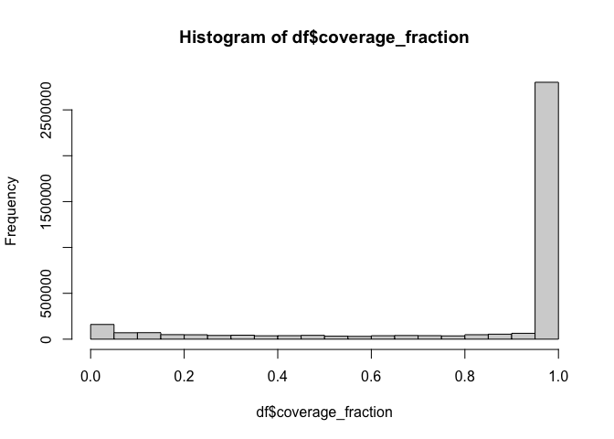<!-- -->

Como muestra el histograma, hay una fracción de datos con una cobertura
inferior al 100%, por lo cual se procede a eliminarlos para evitar
pixeles de borde:

``` r
df %<>% filter(coverage_fraction == 1) %>%
  select(-coverage_fraction) %>% 
  filter(complete.cases(.)) %>% mutate(Class = as.factor(Class))
```

Se procede a computar la clase con menos pixeles y se establece ese
nivel como la cantidad de pixeles para cada clase.

``` r
sample_min <- min(table(df$Class))

df %<>% group_by(Class) %>% sample_n(sample_min)
```

Ya a este punto se poseen los datos para entrenar el modelo, comenzando
con establecer parámetros generales como el tipo de control para la
clasificación:

``` r
control <- trainControl(method = "repeatedcv", number = 10, repeats = 3, search = "grid", allowParallel = TRUE)
```

Luego, para establecer los valores para el ajuste del modelo de ANN, se
debe calcular el número de neuronas a utilizar. Se puede seguir la
siguiente función:


Donde:

-   *N<sub>h</sub>*: Número de neuronas.
-   *N<sub>s<sub>*: Número de muestras.
-   *N<sub>i</sub>*: Número de elementos de entrada.
-   *N<sub>o</sub>*: Número de elementos de salida.
-   Alpha: valor arbitrario de escala, usuamente entre 2 - 10.

Así que se calculan los límites (inferior y superior) junto a niveles
intermedios (truncados por si hay valores decimales):

``` r
nh_min = round(nrow(df)/(10*(13+8)))
nh_max = round(nrow(df)/(2*(13+8)))

tunegrid <- expand.grid(.decay = c(0.5, 0.1, 1e-2, 1e-3,1e-4,1e-5),
                        .size = trunc(seq(from=nh_min, to = nh_max, length.out = 5)))
```

Se procede a comenzar el entrenamiento del modelo:

``` r
cl <- makePSOCKcluster(15)
registerDoParallel(cl)

model <- train(Class~., data = df, method = "nnet", metric = "Kappa", tuneGrid = tunegrid, trControl = control, preProcess = c('center','scale'), verbose = FALSE, trace = FALSE)

stopCluster(cl)
```

La función calcula 30 modelos de clasificación de ANN en función a la
combinación de `tunegrid` dada.

Se procede a evaluar los modelos y revisar el de mejor desempeño:

``` r
print(model)
```

    ## Neural Network 
    ## 
    ## 1464 samples
    ##   13 predictor
    ##    8 classes: '1', '2', '3', '4', '5', '6', '7', '8' 
    ## 
    ## Pre-processing: centered (13), scaled (13) 
    ## Resampling: Cross-Validated (10 fold, repeated 3 times) 
    ## Summary of sample sizes: 1318, 1318, 1317, 1317, 1316, 1316, ... 
    ## Resampling results across tuning parameters:
    ## 
    ##   decay  size  Accuracy   Kappa    
    ##   1e-05   7    0.9974884  0.9971294
    ##   1e-05  14    0.9988568  0.9986934
    ##   1e-05  21    0.9995418  0.9994763
    ##   1e-05  28    0.9990851  0.9989544
    ##   1e-05  35    0.9997685  0.9997354
    ##   1e-04   7    0.9979497  0.9976566
    ##   1e-04  14    0.9986254  0.9984289
    ##   1e-04  21    0.9990836  0.9989526
    ##   1e-04  28    0.9995418  0.9994763
    ##   1e-04  35    0.9988553  0.9986917
    ##   1e-03   7    0.9986222  0.9984253
    ##   1e-03  14    0.9990867  0.9989562
    ##   1e-03  21    0.9988537  0.9986898
    ##   1e-03  28    0.9993135  0.9992153
    ##   1e-03  35    0.9993135  0.9992153
    ##   1e-02   7    0.9986222  0.9984253
    ##   1e-02  14    0.9983986  0.9981698
    ##   1e-02  21    0.9990836  0.9989526
    ##   1e-02  28    0.9986254  0.9984289
    ##   1e-02  35    0.9988553  0.9986917
    ##   1e-01   7    0.9977183  0.9973922
    ##   1e-01  14    0.9981718  0.9979105
    ##   1e-01  21    0.9981718  0.9979105
    ##   1e-01  28    0.9983971  0.9981680
    ##   1e-01  35    0.9983971  0.9981680
    ##   5e-01   7    0.9979466  0.9976531
    ##   5e-01  14    0.9979435  0.9976496
    ##   5e-01  21    0.9979435  0.9976496
    ##   5e-01  28    0.9979435  0.9976496
    ##   5e-01  35    0.9979435  0.9976496
    ## 
    ## Kappa was used to select the optimal model using the largest value.
    ## The final values used for the model were size = 35 and decay = 1e-05.

``` r
plot(model)
```

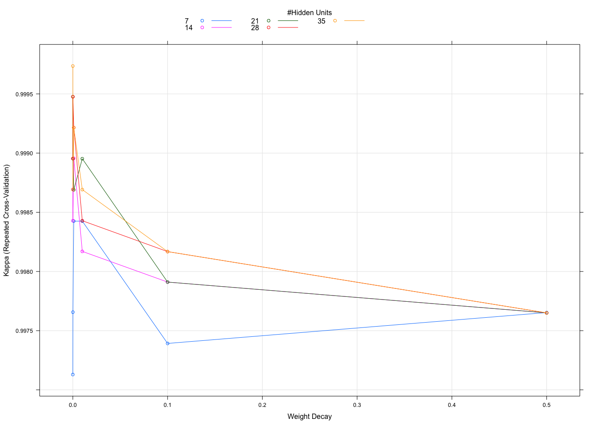<!-- -->

``` r
model$finalModel
```

    ## a 13-35-8 network with 778 weights
    ## inputs: monthly_spline.1 monthly_spline.2 monthly_spline.3 monthly_spline.4 monthly_spline.5 monthly_spline.6 monthly_spline.7 monthly_spline.8 monthly_spline.9 monthly_spline.10 monthly_spline.11 monthly_spline.12 monthly_spline.13 
    ## output(s): .outcome 
    ## options were - softmax modelling  decay=1e-05

Ya que se separaron algunos polígonos para evaluar la exactitud, se
realiza un procedimiento similar al ya ejecutado (para entrenamiento) y
se evalúa la matriz de confusión:

``` r
df_test <- exact_extract(r, sf_test, include_cols = T, force_df = T)

df_test <- lapply(df_test,function(x) x[,-c(2,3)]%>% na.omit(x))

df_test <- do.call(rbind.data.frame,df_test)

df_test %<>% filter(coverage_fraction == 1) %>%
  select(-coverage_fraction) %>% 
  filter(complete.cases(.)) %>% mutate(Class = as.factor(Class))

test_app <- predict(model, newdata = df_test[,-1], 'raw')

confusionMatrix(data = test_app, reference = df_test[,1])
```

    ## Confusion Matrix and Statistics
    ## 
    ##           Reference
    ## Prediction    1    2    3    4    5    6    7    8
    ##          1 2718    0    2    0  243    0    0    0
    ##          2    0  827    0    0    1    0    0    0
    ##          3    0    0  186    0    0    0    0    0
    ##          4    0    0    0 2577    0    0    0   17
    ##          5    0    0    0    0 2477    0    0    0
    ##          6    0    0    0    0    0  118    0    0
    ##          7    0    0    0    0    0    0 1305    0
    ##          8    0    0    0    0    0    0    1 1912
    ## 
    ## Overall Statistics
    ##                                          
    ##                Accuracy : 0.9787         
    ##                  95% CI : (0.976, 0.9812)
    ##     No Information Rate : 0.2197         
    ##     P-Value [Acc > NIR] : < 2.2e-16      
    ##                                          
    ##                   Kappa : 0.974          
    ##                                          
    ##  Mcnemar's Test P-Value : NA             
    ## 
    ## Statistics by Class:
    ## 
    ##                      Class: 1 Class: 2 Class: 3 Class: 4 Class: 5 Class: 6
    ## Sensitivity            1.0000  1.00000  0.98936   1.0000   0.9103 1.000000
    ## Specificity            0.9747  0.99991  1.00000   0.9983   1.0000 1.000000
    ## Pos Pred Value         0.9173  0.99879  1.00000   0.9934   1.0000 1.000000
    ## Neg Pred Value         1.0000  1.00000  0.99984   1.0000   0.9754 1.000000
    ## Prevalence             0.2195  0.06678  0.01518   0.2081   0.2197 0.009528
    ## Detection Rate         0.2195  0.06678  0.01502   0.2081   0.2000 0.009528
    ## Detection Prevalence   0.2393  0.06686  0.01502   0.2095   0.2000 0.009528
    ## Balanced Accuracy      0.9873  0.99996  0.99468   0.9991   0.9552 1.000000
    ##                      Class: 7 Class: 8
    ## Sensitivity            0.9992   0.9912
    ## Specificity            1.0000   0.9999
    ## Pos Pred Value         1.0000   0.9995
    ## Neg Pred Value         0.9999   0.9984
    ## Prevalence             0.1055   0.1558
    ## Detection Rate         0.1054   0.1544
    ## Detection Prevalence   0.1054   0.1545
    ## Balanced Accuracy      0.9996   0.9955

Al juzgar los resultados de la matriz de confusión, se concluye que el
modelo posee un muy buen desempeño. Hay una confusión ligera, cuyos
motivos son explicados en la cápsula subida a Drive.

Como el modelo es apropiado, se procede a ejecutar sobre el área de
estudio (guardando el producto al disco):

``` r
rclass <- predict(r,model)

writeRaster(rclass,'class_results_nnet.tif', overwrite = T)
```

Finalmente, se grafica la red neuronal para visualizar la extensión y
componentes de ésta:

``` r
library(NeuralNetTools)

plotnet(model$finalModel,y_names = c('Suelo sin cultivo','Pradera','Cuerpo de agua','Almendro',
                                     'Olivo','Ciclo corto','Vid de mesa','Vid vinifera'),
        x_names = c(paste0(month.abb[c(7:12,1:6)],', ',rep(c(2020,2021),times = c(6,6))),'SSR'),
        pos_col = "dodgerblue", neg_col = "firebrick")
```

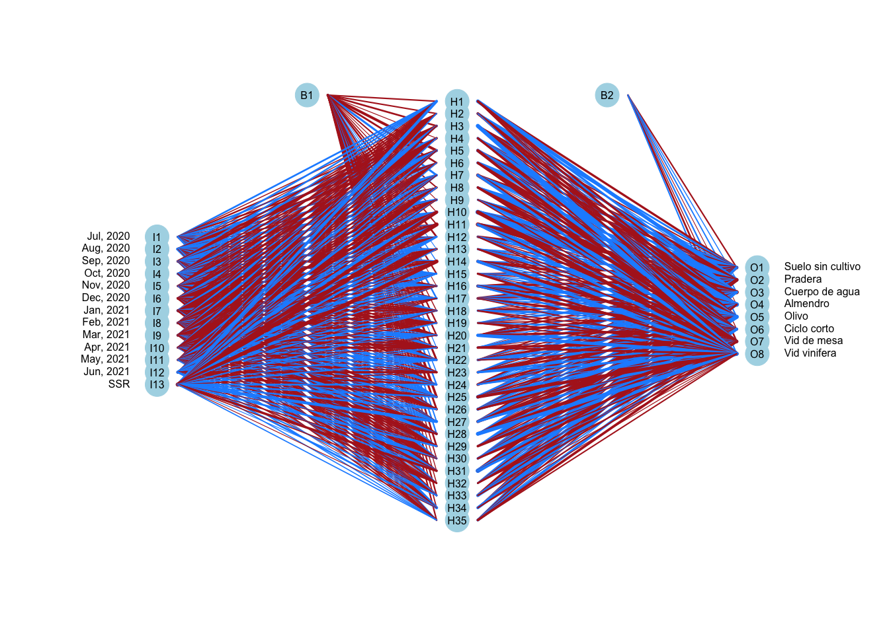<!-- -->

Ya en QGIS se revisan los resultados de la clasificación, incluyendo las
áreas de entrenamiento y la serie de *NDVI* multitemporal para su
verificación.
