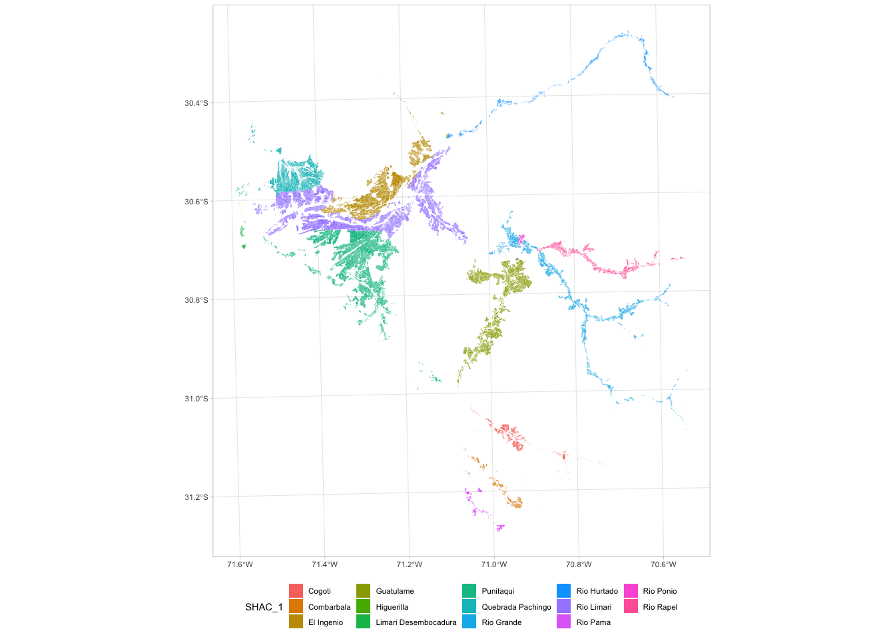
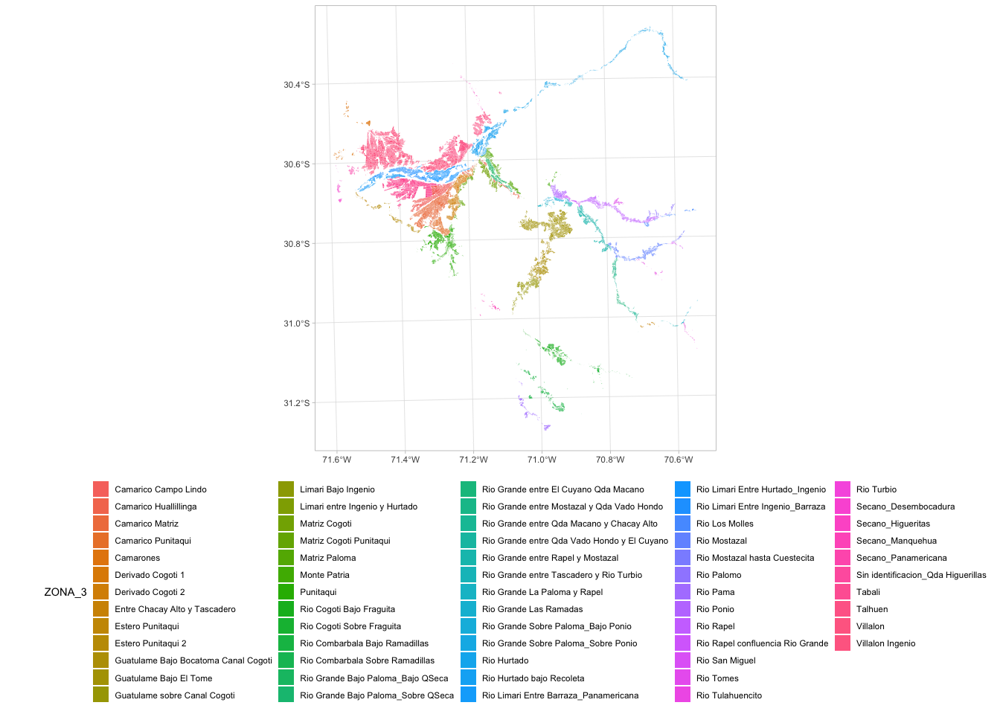

Asignación de demanda a SHAC
================

## Notas previas

Para el cálculo de la demanda agrícola, se agruparon los polígonos de la
cuenca por un campo denominado `FUENTE`, que caracteriza a los polígonos
agrícolas por la fuente hídrica superficial. Para cada fuente, se tomó
una muestra de polígonos por grupo de cultivo y se extrajeron los
valores de Kc desde [IrriSAT](https://irrisat-cloud.appspot.com)
utilizando el [API](https://irrisat-cloud.appspot.com/api) de la misma
plataforma.

Paralelo a esta tarea, se descargaron los datos de ET0 desde
[CeazaMET](http://www.ceazamet.cl) también mediante el uso de [API de
consulta](http://www.ceazamet.cl/ws/pop_ws_doc.php). Estos datos fueron
ingresados a un modelo de regresión espacial de Cokriging utilizando la
altitud y la distancia a la costa como co-variables, obteniendo
productos mensuales de ET0.

Una vez extraídos los Kc de cada fuente por grupo de cultivo, se extrajo
la ET0 promedio mensual para cada uno de los polígonos por fuente.
Utilizando esta información se obtuvo la evapotranspiración de cultivo
utilizando la relación propuesta por FAO56
(*E**T*<sub>*c*</sub> = *E**T*<sub>0</sub> \* *K**c*), la que luego al
ser extrapolada a la superficie por grupo de cultivo y fuente, se obtuvo
los requerimientos hídricos o demanda neta. Cada uno de estos resultados
están en un CSV por Fuente y Grupo de cultivo, incorporando la demanda a
nivel mensual.

## Preparación de archivos

Para poder asociar esa demanda a las diferentes configuraciones, se
planteó en trabajar por fracciones de participación de cada uno de los
campos espaciales solicitados por Fuente. Lo primero es cargar las
librerías utilizadas para este trabajo y el archivo shapefile con la
información necesaria:

``` r
library(sf)
library(tidyverse)

sf <- read_sf('~/Downloads/SUELO_AGRICOLA_LIMARI_monoparte8/SUELO_AGRICOLA_LIMARI_monoparte8.shp')
```

Al revisar los campos que este incluye, se identifican campos de clase
por temporadas, superficie y organización espacial.

``` r
names(sf)
```

    ##  [1] "Cuartel_ID" "Area_ha"    "NOM_REG"    "NOM_PROV"   "NOM_COM"   
    ##  [6] "NOM_SUBC"   "NOM_SSUBC"  "NOM_ORG"    "NOM_ZR"     "ZONA_CLASS"
    ## [11] "NOM_OH"     "Z_REGULADA" "temp2000"   "temp2001"   "temp2002"  
    ## [16] "temp2003"   "temp2004"   "temp2005"   "temp2006"   "temp2007"  
    ## [21] "temp2008"   "temp2009"   "temp2010"   "temp2011"   "temp2012"  
    ## [26] "temp2013"   "temp2014"   "temp2015"   "temp2016"   "temp2017"  
    ## [31] "temp2018"   "temp2019"   "SHAC"       "ID_MAPA"    "CANAL"     
    ## [36] "FUENTE"     "HA_2"       "FUENTE2"    "ZONAS_2"    "SHAC_2"    
    ## [41] "ZONA_3"     "SHAC_3"     "S_HIDROGEO" "SHAC_1"     "ha_inter"  
    ## [46] "geometry"

De los campos de organización espacial, para cumplir con los
requerimientos de los nodos formados en el modelo hidrológico se debe
organizar la demanda por los campos `NOM_ORG`, `ZONA_3`, `S_HIDROGEO` y
`SHAC_1` utilizando el campo `FUENTE`.

La razón de ello, es que cada uno de estos campos están compuestos por
diferentes agrupaciones de polígonos, por ejemplo:


<!-- -->

<!-- -->

Para comenzar, se establece el directorio de trabajo en la carpeta que
contiene los archivos CSV con la demanda, los cuales son almacenados en
el objeto `archivos`:

``` r
setwd('~/Documents/MAPA/Demanda/')
archivos <- list.files(pattern = '.csv')
```

El archivo espacial es convertir a una base de datos, la cual es
transformada para tomar un grupo de variables, agruparlas y dejar solo
una variable, aumentando el número de filas, también botando las
varibables no utilizadas.

``` r
sf %>% st_drop_geometry() %>%
  pivot_longer(starts_with('temp'),names_to='Temporada',values_to='Clase') %>% 
  select(NOM_ORG,ZONA_3,S_HIDROGEO,SHAC_1,Temporada,FUENTE,Clase,ha_inter) %>% 
  mutate(Tyear = as.numeric(gsub(pattern = 'temp',replacement = '',x = Temporada))) %>% 
  select(-Temporada) -> df_temp
```

Se crean diferentes objetos para poder determinar la fracción de
superficie de `FUENTE` por cada combinación de `NOM_ORG`, `ZONA_3`,
`S_HIDROGEO` y `SHAC_1`:

``` r
df_temp %>% filter(Clase %in% c('Caduco','Ciclo corto','Persistente','Pradera')) %>% 
  group_by(NOM_ORG,ZONA_3,S_HIDROGEO,SHAC_1,FUENTE,Tyear) %>% summarise(Superficie = sum(ha_inter, na.rm = T)) -> df_temp2

df_temp %>% filter(Clase %in% c('Caduco','Ciclo corto','Persistente','Pradera')) %>% 
  group_by(FUENTE, Tyear) %>% summarise(Superficie2 = sum(ha_inter, na.rm = T)) -> df_temp3

df_temp2 %>% left_join(df_temp3, by = c('FUENTE'='FUENTE', 'Tyear'='Tyear')) %>% mutate(Fraccion = Superficie/Superficie2) -> df_temp4
```

Se crea un objeto `FUENTE` para poder iterar, al igual se crea una
variable llena de 0 para el objeto `df_temp4`, el cual es usado en la
iteración

``` r
FUENTE <- gsub(pattern = '_.*',replacement = '',archivos)

df_temp4$Demanda <- 0
```

## Demanda por temporada

La iteración de demanda por temporada toma el objeto `df_temp4`, itera
fila a fila seleccionando la fuente hídrica, la compara con los archivos
CSV, carga cada archivo asociado a esta fuente y extrae los valores de
demanda por temporada (de mayo a abril). Ya que los CSV están por mes,
se realiza una suma de todos las demandas mensuales por cada una de las
temporadas.

``` r
for(i in 1:dim(df_temp4)[1]){
  fuente_ <- df_temp4$FUENTE[i]
  ix_ <- which(fuente_ == FUENTE)
  year_ <- df_temp4$Tyear[i]
  l2 <- list()
  for(j in ix_){
    l2_ <- read_csv(archivos[j])
    
    if(sum(l2_$anho %in% year_)> 1){
      l2_a <- l2_[l2_$anho %in% year_,]
      l2_a <- l2_a[5:12,]
    }
    if(sum(l2_$anho %in% year_ + 1)> 1){
      l2_b <- l2_[l2_$anho %in% (year_ + 1),]
      l2_b <- l2_b[1:4,]
    }
    if(dim(l2_a)[1]>1 & dim(l2_b)[1]>1){
      l2_c <- rbind(l2_a,l2_b)
    }else{
      if(dim(l2_a)[1]>1){
        l2_c <- l2_a
      }else{
        l2_c <- l2_b
      }
    }
    
    l2[[j]] <- sum(l2_c['Demanda'],na.rm = T)
  }
  demanda_ <- do.call(sum,l2)
  df_temp4[i,'Demanda'] <- demanda_
  remove(l2_a,l2_b,l2_c)
}
```

Finalmente la demanda por fuente es ajustada por la fracción de
participación de esa fuente por la configuración de múltiple campos ya
mencionados y se guarda la demanda por temporada.

``` r
df_temp4 %>% mutate(Demanda2 = Demanda * Fraccion) %>% group_by(NOM_ORG,ZONA_3,S_HIDROGEO,SHAC_1,Tyear) %>% 
  summarise(Demanda = round(sum(Demanda2))) -> df_temp5

write_csv(df_temp5,'~/Documents/MAPA/Demanda/Demanda_17_nov_temporada.csv')
```

## Demanda por mes

El procedimiento de demanda por mes es similar. Ya que se modificó el
objeto `df_temp4`, se vuelve a definir:

``` r
df_temp2 %>% left_join(df_temp3, by = c('FUENTE'='FUENTE', 'Tyear'='Tyear')) %>% mutate(Fraccion = Superficie/Superficie2) -> df_temp4
```

La única diferencia de este procedimiento es que no se realiza una suma
por temporada, sino que se extraen las columnas de año y mes para
realizar el procedimiento.

``` r
l3 <- list()

for(i in 838:dim(df_temp4)[1]){
  fuente_ <- df_temp4$FUENTE[i]
  ix_ <- which(fuente_ == FUENTE)
  year_ <- df_temp4$Tyear[i]
  l2 <- list()
  for(j in ix_){
    l2_ <- read_csv(archivos[j])
    
    if(sum(l2_$anho %in% year_)> 1){
      l2_a <- l2_[l2_$anho %in% year_,]
      l2_a <- l2_a[5:12,]
    }
    if(sum(l2_$anho %in% year_ + 1)> 1){
      l2_b <- l2_[l2_$anho %in% (year_ + 1),]
      l2_b <- l2_b[1:4,]
    }
    if(dim(l2_a)[1]>1 & dim(l2_b)[1]>1){
      l2_c <- rbind(l2_a,l2_b)
    }else{
      if(dim(l2_a)[1]>1){
        l2_c <- l2_a
      }else{
        l2_c <- l2_b
      }
    }
    
    l2[[j]] <- l2_c[,c('anho','mes','Demanda')]
  }

  demanda_ <- do.call(rbind.data.frame,l2)
  demanda_ %>% group_by(anho,mes) %>% summarise(Demanda = sum(Demanda,na.rm = T)) -> demanda_
  l3[[i]] <- df_temp4[i,] %>% cbind(demanda_)
  
  remove(l2_a,l2_b,l2_c)
}
```

El paso final es similar al procedimiento anterior, salvo algunas
diferencias.

``` r
l3 <- do.call(rbind.data.frame,l3)

l3 %>% ungroup() %>% mutate(Demanda2 = Demanda * Fraccion) %>% group_by(NOM_ORG,ZONA_3,S_HIDROGEO,SHAC_1,Tyear,anho,mes) %>% 
  summarise(Demanda = round(sum(Demanda2))) -> df_temp5

write_csv(df_temp5,'~/Documents/MAPA/Demanda_17_nov_mensual.csv')
```
